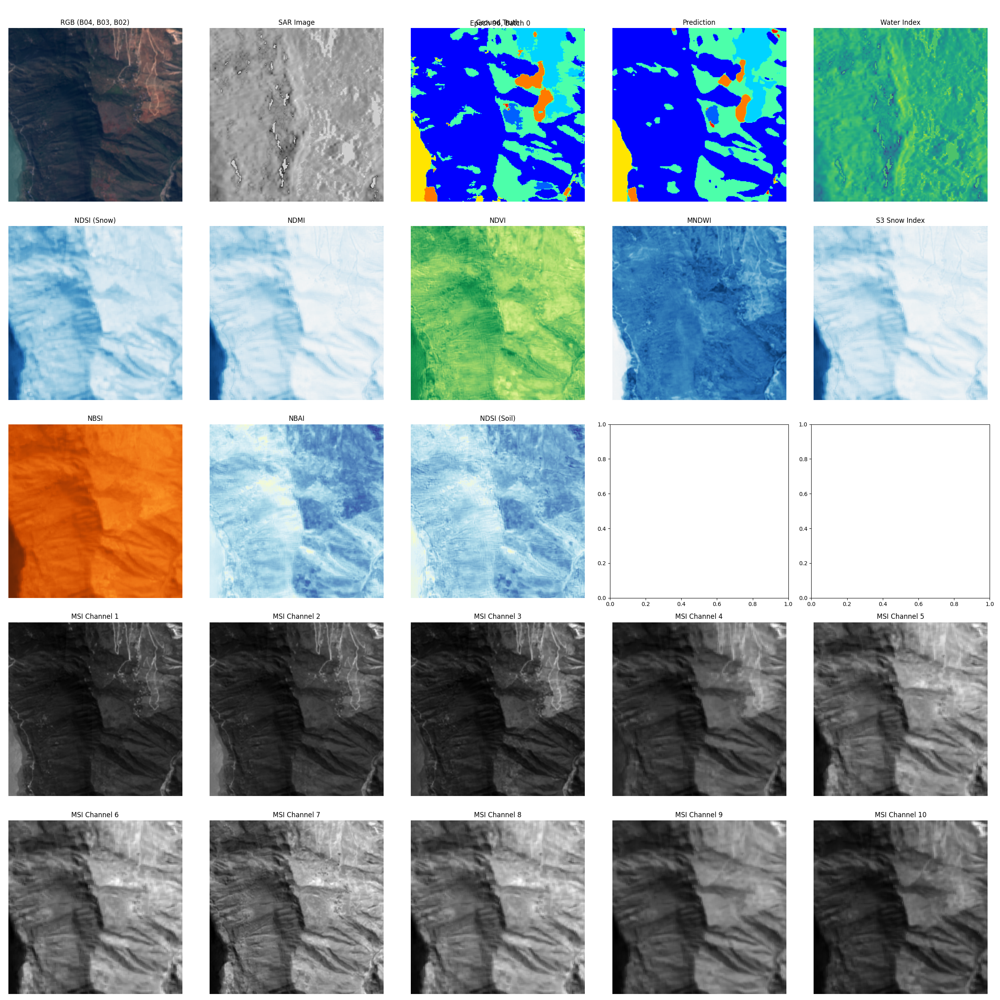

# whispers-2024-MMSeg-YREB
Repo for code related to my participation at WHISPERS 2024 Multi-Modal Remote Sensing Semantic Segmentation Challenge.

## Overview

This project serves as an example of how to approach to multi-class semantic segmentation. This implementation secured me a position in the top 15 competitors in IAAA MMSeg competition.

## Key Features

1. Custom UNet architecture for image segmentation
2. Complex data loader with support for multi-band satellite imagery and custom indexes
3. Custom loss function for multi-class segmentation
4. Training pipeline with support for multi-class segmentation and visualization
5. Model inference and evaluation

## Installation
- Tested on Python 3.9.19

1. Clone this repository
2. Open and activate new virtual environment:
```python -m venv venv```
```source venv/bin/activate```
3. Install the required dependencies:
```pip install -r requirements.txt```

## Data Source

Training and testing was done on the IAAA MMSeg competition dataset (Yangtze River Economic Belt (__YREB__), China).

- Multispectral (Sentinel-2), __12__ bands, 10m GSD.
- SAR (Sentinel-1), __2__ bands, 10m GSD.
- Mean synthesis from Jan. 2021 to Jan. 2022.

- The upper/lower reaches of YREB are used for train/test set construction. 
- 12000 (10000:2000) image samples with patch size of 256×256, 9 classes.
- Both category and pixel value distributions varies across train and test sets.

Classes include: 
- "Background", "Tree", "Grassland", "Cropland", "Low Vegetation","Wetland", "Water", "Built-up", "Bareground", "Snow"
        
[](https://postimg.cc/1gPDzxfv)

## Dataset Structure
```
MMSeg-YREB
    traintest.txt
    test.txt
    train.txt
├─ train
│   ├─ SAR
│   │       Tile_212_tile_1_15.tif
│   │       Tile_97_tile_23_21.tif
│   │       Tile_36_tile_20_0.tif
│   │       ...
│   ├─ label
│   │       Tile_212_tile_1_15.tif
│   │       Tile_97_tile_23_21.tif
│   │       Tile_36_tile_20_0.tif
│   │       ...
│   ├─ MSI
│   │       Tile_212_tile_1_15.tif
│   │       Tile_97_tile_23_21.tif
│   │       Tile_36_tile_20_0.tif
│   │       ...
├─ test
│   ├─ SAR
│   │       Tile_136_tile_0_20.tif
│   │       Tile_253_tile_25_16.tif
│   │       Tile_261_tile_18_24.tif
│   │       ...
│   ├─ MSI
│   │       Tile_136_tile_0_20.tif
│   │       Tile_253_tile_25_16.tif
│   │       Tile_261_tile_18_24.tif
│   │       ...
```
## Usage

1. Setup dataset structure as shown above and optionally edit dataloader.py to match your dataset structure.
2. Start training by running:
```python3 train.py```
3. Model checkpoints will be saved in the 'checkpoints' directory (lowest validation loss). 
4. Start inference by running:
```python3 inference.py```

Don't forget to edit class numbers and other parameters that may differ from the competition dataset.

## Examples

Example of inputs and outputs during training:

<div style="text-align: center;">
    
</div>


